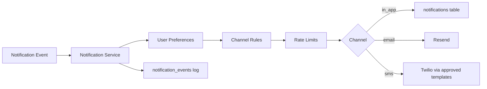

# Notification Architecture

Centralized notification system for BloomBay. All new notification sends should flow through `createNotificationEvent` in `lib/notifications/notification-service.ts`.

## Flow



```
Notification Event → Notification Service → User Preferences → Channel Rules → Rate Limits → Send / Log
```

## Database schema

### `notification_events` (migration 113 + 116)

| Column | Type | Notes |
|--------|------|-------|
| id | uuid PK | |
| user_id | uuid FK → profiles | |
| type | text | e.g. `member_approved`, `event_reminder` |
| channel | text | `in_app` \| `email` \| `sms` |
| payload | jsonb | request payload snapshot |
| status | text | `pending` \| `sent` \| `failed` \| `skipped` |
| created_at | timestamptz | |
| sent_at | timestamptz | set on success |
| error_message | text | skip/fail reason |

Indexes: `user_id`, `status`, `created_at`, `type`.

### `notification_preferences` (migration 113 + 116)

| Column | Default | Purpose |
|--------|---------|---------|
| email_enabled | true | Master email toggle |
| in_app_enabled | true | Master in-app toggle |
| sms_enabled | false | Opt-in SMS |
| event_reminders | true | Event/ticket reminders |
| club_updates | true | Club join/accept |
| girlmate_messages | true | Girlmate DMs |
| bloom_requests | true | Bloom request alerts |

RLS: users read/update own preferences. Service role writes events.

### `notifications` (legacy in-app inbox, migration 029)

Still used for member-facing inbox UI. The notification service inserts here for `in_app` channel.

## Core API

```ts
import { createNotificationEvent } from "@/lib/notifications/notification-service";

await createNotificationEvent({
  userId: "...",
  type: "bloom_request",
  channels: ["in_app", "email"], // optional — auto-resolved if omitted
  payload: {
    title?: string;
    body?: string;
    link?: string;
    templateVars?: Record<string, string>;
    data?: Record<string, unknown>;
  },
  force?: boolean,       // skip preference check (urgent safety only)
  actorId?: string,      // required for admin-triggered SMS
  actorRole?: string,    // "admin" | "founder"
});
```

Admin waitlist batch SMS (no profile `user_id`):

```ts
import { sendAdminWaitlistSmsBatch } from "@/lib/notifications/notification-service";
```

## Channel policy

| Type | in_app | email | sms |
|------|--------|-------|-----|
| `private_beta_accepted` | ✓ | ✓ | ✓ admin/founder only |
| `app_launch` | ✓ | ✓ | ✓ admin/founder only |
| `phone_verification` | ✓ | — | ✓ future |
| `urgent_safety` | ✓ | ✓ | ✓ `force=true` |
| `reservation_*` | ✓ | ✓ | **blocked** |
| `event_reminder` / `ticket_confirmed` | ✓ | ✓ | **blocked** |
| `bloom_request*` | ✓ | ✓ | **blocked** |
| `girlmate_message` | ✓ | ✓ | **blocked** |
| `day3_nudge` / `day7_nudge` / `intro` | ✓ | — | **blocked** |
| `club_*` | ✓ | ✓ | **blocked** |
| `member_approved` | ✓ | — | **blocked** |

SMS bodies must come from `lib/notifications/templates.ts` — no arbitrary strings in routes.

## Rate limits (`lib/notifications/rate-limits.ts`)

| Limit | Value |
|-------|-------|
| in_app + email combined / user / 24h | 50 |
| email / user / 24h | 10 |
| sms / user / 24h | 3 (admin-triggered only) |
| admin waitlist SMS batch | 500 (`ADMIN_SMS_BATCH_LIMIT`) |

Counts query `notification_events` where `status IN ('sent', 'pending')` in the last 24 hours.

## Notification types

Defined in `lib/notifications/templates.ts`:

- SMS-permitted: `private_beta_accepted`, `app_launch`, `phone_verification`, `urgent_safety`
- Reservations: `reservation_requested`, `reservation_confirmed`, `reservation_cancelled`
- Clubs: `club_joined`, `club_application_approved`, `club_application_rejected`, `club_accepted`, `club_update`
- Events: `event_reminder`, `ticket_confirmed`
- Membership: `membership_activated`, `membership_confirmed`, `member_approved`
- Social: `girlmate_message`, `bloom_request`, `bloom_request_accepted`
- Yande: `day3_nudge`, `day7_nudge`, `yande_nudge`, `yande_question`, `intro`, `celebrate`
- Verification: `verification_submitted`, `verification_approved`, `verification_rejected`

## Migration status

### Routes using `createNotificationEvent` / service

| Route / module | Channels |
|----------------|----------|
| `app/api/admin/approve-member/route.ts` | in_app |
| `app/api/admin/waitlist/notify/route.ts` | SMS via `sendAdminWaitlistSmsBatch` |
| `app/api/payments/stripe/webhook/route.ts` | in_app + email |
| `app/api/member/bloom-requests/route.ts` | in_app + email (SMS removed) |
| `app/api/reservations/route.ts` | in_app |
| `app/api/reservations/confirm/route.ts` | in_app + email |
| `app/api/cron/community-coordinator/route.ts` | in_app only |
| `lib/yande/community-coordinator.ts` | in_app only |
| `app/api/irl/reserve/route.ts` | in_app (SMS removed) |
| `app/api/member/calendar/route.ts` | in_app (SMS removed) |
| `app/api/member/profile/notifications/route.ts` | in_app ack (SMS removed) |
| `app/api/sms/send/route.ts` | blocked — returns `skipped` |

### Remaining direct sends (TODO: migrate)

| Location | Current behavior |
|----------|------------------|
| `app/api/member/bloom-requests/[id]/respond/route.ts` | direct `notifications.insert` (yande_question) |
| `app/api/member/witness/route.ts` | direct insert |
| `app/api/member/flowers/route.ts` | direct insert |
| `app/api/member/pin-drops/route.ts` | bulk direct insert |
| `app/api/clubs/[id]/patch-order/route.ts` | direct insert |
| `app/api/whop/webhook/route.ts` | direct insert |
| `app/api/cron/yande-scientist/route.ts` | direct insert |
| `app/api/cron/yande-host/route.ts` | direct insert |
| `app/api/cron/founder-analyst/route.ts` | direct insert |
| `app/api/cron/event-intelligence/route.ts` | direct insert |
| `app/api/cron/club-success/route.ts` | direct insert |
| `lib/yande/safety.ts` | direct insert |
| `lib/yande/operations.ts` | direct insert |
| `lib/yande/messages.ts` | direct insert |
| `lib/yande/scheduling.ts` | direct insert |
| `lib/yande/customer-service.ts` | direct insert |
| `lib/actions/notifications.ts` | direct insert |
| `lib/welcome/send-member-welcome.ts` | direct Resend + Twilio |
| `lib/sms/send-member-reminder.ts` | legacy wrapper (deprecated) |

## SMS blocked paths

These previously sent SMS and are now in-app/email only:

- `app/api/irl/reserve/route.ts` — seat confirmation
- `app/api/member/calendar/route.ts` — calendar reminders
- `app/api/member/profile/notifications/route.ts` — SMS opt-in ack
- `app/api/member/bloom-requests/route.ts` — bloom requests
- `app/api/sms/send/route.ts` — legacy endpoint disabled
- `app/api/cron/weekly-events/route.ts` — already disabled
- All Yande nudge paths — in-app only

## Environment variables

| Variable | Purpose |
|----------|---------|
| `TWILIO_ACCOUNT_SID` | Twilio SMS |
| `TWILIO_AUTH_TOKEN` | Twilio SMS |
| `TWILIO_FROM_NUMBER` | Twilio sender |
| `RESEND_API_KEY` | Email via Resend |
| `RESEND_FROM` | Email from address |
| `CRON_DRY_RUN` | When `true`, crons skip writes (including notifications) |
| `CRON_ENABLED` | Kill switch for all crons |
| `CRON_SECRET` | Cron auth header |

## File map

```
lib/notifications/
  notification-service.ts  — createNotificationEvent, sendAdminWaitlistSmsBatch
  channel-rules.ts         — SMS policy, preference gates
  rate-limits.ts           — daily caps
  templates.ts             — approved copy for all channels
  sms.ts                   — Twilio thin wrapper (service calls this, not routes)

supabase/migrations/
  113_notifications_architecture.sql  — initial tables
  116_notification_system.sql         — indexes + RLS hardening
```

## Cron integration

Crons should call `createNotificationEvent` and respect `isDryRun()` from `lib/cron-guard.ts`. No SMS from crons except admin batch waitlist notify.

Admin SMS batches are audited via `lib/admin/audit-log.ts` (`waitlist_sms_batch` action).
