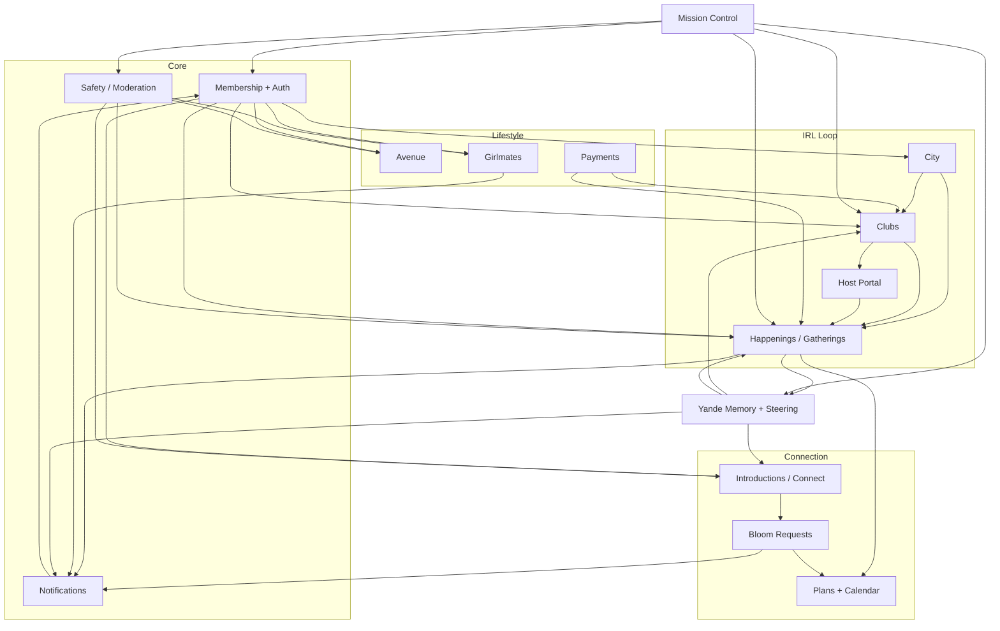

# BloomBay Product Architecture

> **Purpose:** Product-level map of the BloomBay ecosystem for founder review before private beta.  
> **Audience:** Founding team, product, ops — not engineering implementation detail.  
> **Sources:** Architecture docs in repo, app routes, and current prototype state (June 2026).  
> **Honesty note:** Many surfaces are visually complete but still backed by mock data, localStorage, or partial Supabase wiring. This doc distinguishes what is real today from what is aspirational.

---

## 1. Product Vision

BloomBay is a **city-first ecosystem for women** — not a single app, but a connected world of neighborhoods, clubs, IRL gatherings, housing discovery, editorial culture, and concierge intelligence (Yande). Members ("Bloomies") move through a loop: discover their city, join clubs, reserve seats at Happenings, meet women IRL, and deepen connection through Bloom Requests, Plans, and The Lounge. Around them operate distinct operator surfaces: **Mission Control** (founder/ops), **Clubhouse** (club owners), **Curator** (community managers), and **Partner** (venues/brands). The product thesis is that women's social life deserves infrastructure — tables, clubs, rooms, and memory — not another generic feed.

---

## 2. Primary User Personas

### Member (Bloomie)
**Goals:** Find her people in a new or familiar city; have somewhere to go; build real friendships IRL.  
**Needs:** Verified, women-only community; discover City spots and Clubs; reserve Seats at Happenings; send Bloom Requests; optional housing search (Girlmates / New Keys); personal home board with Yande nudges; safety tools (block, report, witness).

### Founder / Admin / Moderator
**Goals:** Launch and steward the city; approve members; keep the community safe; read truth metrics.  
**Needs:** Mission Control at `/founder/*` (full) and `/admin/*` (ops subset): waitlist/submissions queue, verification review, bloom requests oversight, safety center, live stats, club/portner management, Yande Mission Center.

### Club Owner / Host (Club Mama)
**Goals:** Run a recurring women's club with brand, members, and gatherings.  
**Needs:** Clubhouse portal at `/club-owner/*`: branding, member applications, gatherings calendar, broadcasts, finances, attendance/scan, moderation. Distinct from venue partners.

**Also:** Any verified member can host lighter gatherings via `/member/host` (Host Portal inside member app) — dinner, brunch, open seat, traditions — without owning a full club.

### Curator
**Goals:** Community-manage gatherings and women in a city/neighborhood; earn payouts.  
**Needs:** Curator portal at `/curator/*` (login via `/admin/login`): dashboard, gatherings list, women roster, pay — scoped operational role, not founder access.

### Partner
**Goals:** Venues and brands reach BloomBay women; run drops, reservations, co-branded happenings.  
**Needs:** Partner portal at `/partner/*`: venue profile, drops, reservation confirmations, storefront visibility in City.

---

## 3. Primary User Journeys

### Journey 1: Waitlist → Apply → Verify → Onboard → Home
| Stage | Touchpoints | Systems | Success |
|-------|-------------|---------|---------|
| Discovery | `/`, `/waitlist`, marketing site | Waitlist (`waitlist` table) | Woman joins waitlist |
| Application | Bloom Suite signup, `/onboard` | `member_applications`, Supabase Auth | Account created |
| Approval | Founder `/founder/submissions`, `/founder/verification` | Admin approve-member API, `profiles.verified` | Member approved |
| Onboard | `/onboard` → `/member/home` | Profile bootstrap, preferences | Personalized home board |
| Ongoing | Home scrapbook, Yande one-liner | Yande behavior signals, home glance API | Member returns daily |

**Current state:** Auth and Phase 1 truth writes work. Verification queue exists but demo shortcuts remain; onboarding sends members to home immediately (async verification).

---

### Journey 2: Discover City → Join Club → Attend Happening
| Stage | Touchpoints | Systems | Success |
|-------|-------------|---------|---------|
| Explore city | `/member/city`, neighborhoods, places | City trending, partner storefronts, search APIs | Finds neighborhood + spots |
| Find club | `/member/clubs`, Yande picks | `clubs`, club discovery | Identifies fit club |
| Apply/join | Club apply, `/api/irl/join-club` | `club_applications`, `club_memberships` | Member of club |
| See happening | `/member/happenings`, poster feed | `gatherings`, happenings UI | Finds seat |
| RSVP | Seat page, `/api/irl/reserve` | `seat_reservations`, SMS optional | Seat reserved |
| IRL | Scan/check-in, witness | `gathering_attendance`, `gathering_witnesses`, stamps | Attended + social proof |

**Current state:** Core IRL loop is Phase 1 priority and largely wired to Supabase. City content mixes real API + mock data.

---

### Journey 3: Girlmates Housing → Message → Meet
| Stage | Touchpoints | Systems | Success |
|-------|-------------|---------|---------|
| Browse | `/member/girlmate`, `/member/lounge/girl-mate` | Girlmate listings, lifestyle quiz | Finds listing or posts seeker profile |
| Match | Compatibility badge, filters | Search API (partial), `girlmate_messages` | Identifies compatible roommate |
| Message | In-app DM | `/api/girlmate/messages` (rate-limited, block-checked) | Conversation started |
| Meet | Off-platform or Bloom happening | Safety, block/report | Roommate decision |

**Current state:** UI is rich; listings use mock data (`lib/girlmate/mock-data.ts`). Messaging API exists with guardrails. **Not beta-critical** unless housing is a launch pillar.

---

### Journey 4: Bloom Request → Match → Plan
| Stage | Touchpoints | Systems | Success |
|-------|-------------|---------|---------|
| Discover women | `/member/connect`, `/member/match`, `/member/introductions` | Introductions UI, Yande match queue | Sees suggested women |
| Send request | Bloom Request note | `bloom_requests`, `/api/member/bloom-requests` | Request sent |
| Accept | Notification, respond API | Notifications, Yande signals | Mutual opt-in |
| Plan together | `/member/plans`, calendar | `bloomies_plans`, `member_calendar_plans` | IRL plan scheduled |

**Current state:** Bloom Requests write to Supabase with rate limits. Introductions page is largely demo UI; Yande match queue is designed but not fully live. Chemistry % shown in UI is **non-functional demo data** (explicitly flagged for removal).

---

### Journey 5: Avenue — Editorial & Social Rooms
| Stage | Touchpoints | Systems | Success |
|-------|-------------|---------|---------|
| Enter | `/member/avenue`, `/member/lobby` | Avenue hub, room config | Chooses room |
| Participate | Wall, Fashion, Eats, Magazine, Screening Room, Hanger | `avenue_content`, wall posts, fashion posts | Posts, saves, engages |
| Discover people | Top posts, profiles link back to Avenue | Social graph, flowers | Finds women with shared taste |

**Current state:** Avenue is a major UI investment with multiple sub-rooms. Content mix of Supabase-backed posts and mock/seed data. Magazine has AI generation (founder/admin gated).

---

### Journey 6: Host Creates Happening → Members RSVP
| Stage | Touchpoints | Systems | Success |
|-------|-------------|---------|---------|
| Host creates | `/member/host` or `/club-owner/gatherings` | `gatherings`, club-portal API | Gathering published |
| Promote | Club broadcast, happenings feed | `club_broadcasts`, happenings posters | Members see it |
| RSVP | `/member/happenings/[id]/seat` | `seat_reservations` | Seats fill |
| Post-event | Host recap, Yande post-event cron | `yande/post-event`, witnesses | Retention + repeat |

**Current state:** Member Host writes to gatherings via actions; Clubhouse has fuller studio. Founder events studio still partially localStorage until full sync.

---

### Journey 7: Founder Ops — Approve & Launch Cohort
| Stage | Touchpoints | Systems | Success |
|-------|-------------|---------|---------|
| Review queue | `/founder/submissions`, `/admin/submissions` | Waitlist notify (founder-controlled SMS) | Cohort invited |
| Verify ID | `/founder/verification` | Storage buckets, `profiles.verified` | Trust layer active |
| Monitor | `/founder/dashboard`, live stats | IRL funnel metrics (Cohort-14) | Healthy activation |
| Safety | `/founder/safety`, moderation | `safety_reports`, `content_moderation` | Issues resolved |

---

### Journey 8: Partner Drop → Member Claims
| Stage | Touchpoints | Systems | Success |
|-------|-------------|---------|---------|
| Partner sets up | `/partner/dashboard` | Partner portal API | Drop live |
| Member sees | `/member/drops`, Avenue Drops Blvd | `bloom_drops`, `drop_claims` | Claim made |
| Redeem IRL | QR/verify at venue | `/api/drops/redeem` | Partner ROI |

**Current state:** Flow exists; beta scope depends on partner count in launch city.

---

## 4. Product Domains (The "Systems")

| Domain | Purpose | Key Entities | Depends On | Depended On By |
|--------|---------|--------------|------------|----------------|
| **Membership** | Identity, roles, verification, trust | `profiles`, `waitlist`, `member_applications` | Auth (Supabase) | All domains |
| **City** | Neighborhood discovery, places, trends, solo plans | `city_trending`, partners, places | Membership, Partner | Clubs, Happenings, Avenue |
| **Clubs** | Recurring women's groups with crests & culture | `clubs`, `club_memberships`, `club_applications`, traditions | Membership | Happenings, Host Portal, Yande |
| **Events / Gatherings / Happenings** | IRL scheduled experiences with seats | `gatherings`, `seat_reservations`, `gathering_attendance`, witnesses | Clubs, Membership, Notifications | Plans, Yande, Payments |
| **Girlmates (New Keys)** | Roommate/housing matching | Listings, `girlmate_messages`, seeker profiles | Membership, Safety | Notifications |
| **Introductions / Connect** | Social discovery & opt-in matching | `introductions`, `come_with_me_posts`, `friendship_scores` | Yande, Membership, Safety | Bloom Requests, Plans |
| **Bloom Requests** | Wax-sealed connection requests between women | `bloom_requests` | Introductions/Yande, Notifications, Safety | Plans, Bouquet |
| **Plans** | Member-initiated group plans & plan rooms | `bloomies_plans`, invites, plan messages, calendar | Membership, Happenings (optional link) | Notifications |
| **Avenue** | Editorial & lifestyle social rooms | `avenue_content`, wall, fashion, magazine pitches | Membership, Storage | City, Partner Drops |
| **The Lounge / Room** | Private social space, bouquet, memories | Bouquet, `moments`, mailbox, wall variants | Membership | Bloom Requests |
| **Yande** | Memory, steering, match suggestions — not chat | `member_behavior_signals`, `yande_user_context`, match queue, cron agents | All IRL + social actions | Home, Introductions, Clubs, Notifications |
| **Notifications** | In-app, email, SMS with policy | `notifications`, `notification_events`, preferences | Membership | All action domains |
| **Safety / Moderation** | Block, report, witness, content review | `user_blocks`, `user_reports`, `safety_reports`, moderation queue | Membership | Girlmates, Introductions, Avenue, Happenings |
| **Payments** | Tickets, memberships, hanger checkout | Stripe, `tickets`, `pending_orders`, Whop (legacy) | Happenings, Clubs | Partner, Clubhouse finances |
| **Host Portal** | Member-side hosting + Clubhouse ops | Member `/member/host`; Club `/club-owner/*` | Clubs, Gatherings, Membership | Happenings, Yande host cron |
| **Mission Control** | Founder/admin/curator operations | Submissions, stats, verification, Yande center | All truth tables | Launch ops, Safety |

---

## 5. System Dependency Map

**Reading the map:** The IRL loop (City → Clubs → Happenings) is the north star. Yande reads behavior from that loop and feeds Introductions/Bloom Requests. Avenue and Girlmates are parallel lifestyle lanes. Mission Control sits above truth data, not inside member UX.

---

## 6. Overlapping Concepts (Honest Assessment)

### Gatherings vs Events vs Happenings
| | Today | Recommendation |
|---|-------|----------------|
| **Product language** | "Happenings" and "gatherings" (World Bible); "Events" avoided in copy | Standardize on **Happenings** (member-facing) and **gatherings** (data model) |
| **Database** | `gatherings` is canonical for member IRL; legacy `public.events` still exists with admin/founder routes | **Merge conceptually** — one Happening model; deprecate `events` table after migration |
| **Code** | `lib/actions/events.ts` already reads `gatherings`; UI route is `/member/happenings` | Finish founder/club-owner sync off localStorage (`bloombay-events-store`) |

### Yande: AI Memory vs Conversational Assistant
| | Today | Recommendation |
|---|-------|----------------|
| **What it is** | Rules-first memory: behavior signals → aggregation → one-line nudges + cron agents (host coaching, post-event, match queue). Explicitly **not** a chatbot (YANDE_ARCHITECTURE.md, World Bible) | Keep this identity |
| **UI** | Short copy on home, bloom cards, founder Yande Mission Center | No always-on chat in V1 beta |
| **Future** | LLM for magazine/editorial and founder tools; learning loop tables exist | Add LLM copy **after** rules engine validated on real attendance data |

### Club Owner vs Host Portal
| | Today | Recommendation |
|---|-------|----------------|
| **Club Owner** | Full Clubhouse at `/club-owner/*`, role `club_owner`, ~35 pages (brand, members, finances) | **Separate product surface** — for women running official clubs |
| **Member Host** | `/member/host` — any member creates dinners, traditions, open seats | **Permission + feature tier**, not a separate login |
| **Overlap** | Both create `gatherings`; club-owner has richer ops | Club Owner inherits Host capabilities; Host does not get Clubhouse unless promoted |

### Girlmates vs Introductions
| | Today | Recommendation |
|---|-------|----------------|
| **Girlmates** | Housing/roommate at `/member/girlmate` — mock listings, real messaging API | **Split product lane**: "New Keys" / housing |
| **Introductions** | Social matching at `/member/introductions`, `/member/match` — demo cards, Come With Me feed | **Split product lane**: friendship connection |
| **Shared** | Both need Safety, Notifications, optional Yande compatibility | Shared **trust + messaging infra**, separate UX and launch gates |

### Plans vs Events
| | Today | Recommendation |
|---|-------|----------------|
| **Plans** | Member-initiated `bloomies_plans` with invites, plan room, tickets | Personal/small-group coordination |
| **Happenings** | Platform/club/host scheduled gatherings with capacity | Community calendar |
| **Overlap** | `happening-plan-room` links a happening to a plan room; calendar spans both | **Keep separate entities** — Plans can *attach to* a Happening but shouldn't duplicate it |

### Avenue vs Member Home
| | Today | Recommendation |
|---|-------|----------------|
| **Home** | Personal scrapbook: greeting, clubs, upcoming happenings, Yande nudge, host recap | **"Your BloomBay"** — personalized, action-oriented |
| **Avenue** | Editorial district: Wall, Fashion, Eats, Magazine, Drops | **"The city's culture"** — browse, post, discover taste |
| **Overlap** | Wall/The Room exists at both `/member/room` and `/member/avenue/wall`; Drops linked from Avenue | **Clarify content strategy**: Home = what matters to *you*; Avenue = what the *city* is talking about. Consider retiring duplicate `/member/room` hub or making it a redirect |

---

## 7. What Belongs Together vs Independent

| Share Infrastructure | Stay Decoupled (Separate Teams/Scale) |
|---------------------|--------------------------------------|
| Auth + Membership + Roles | Member portal vs Clubhouse vs Mission Control |
| Notifications (central service + channel rules) | Avenue editorial vs IRL Happenings |
| Safety (block, report, moderation pipeline) | Girlmates vs Introductions product lanes |
| Yande behavior signals + memory layer | Yande cron agents (can scale independently) |
| Search (`/api/member/search/*`) | City intelligence cron vs member search UX |
| Storage buckets + upload audit | Partner portal vs member media |
| Payments (Stripe) webhooks | Hanger marketplace vs event tickets |
| Supabase truth layer (`lib/truth/client`) | Plans UI (heavy client) vs gatherings API |
| Flowers / social reactions pattern | Magazine AI generation vs member posts |

---

## 8. Beta-Critical Product Boundaries

### Must work end-to-end (private beta)
- Waitlist → invite → member login → onboard → **home**
- **Verification gate** on Happenings/intros (even if manual founder queue)
- **RSVP / reserve seat** → Supabase truth (`seat_reservations`)
- **Check-in + witness + stamp** IRL loop
- **Join club** / club application flow
- **Bloom Request** send/accept with notifications
- **Block + report** safety basics
- Founder **approve member** + submissions queue
- Club Owner: create gathering + see members (minimum viable Clubhouse)
- Notification: in-app + email; SMS only founder-controlled templates (waitlist accept)

### Can stay prototype / demo for beta
- Girlmates listings (mock data OK if feature hidden or labeled beta)
- Introductions swipe/demo cards and chemistry %
- Full Avenue room content (seed/mock acceptable if Wall + one room live)
- Plans plan-room chat polish (basic create/invite OK)
- Stripe paid tickets / Whop memberships (unless monetization is beta goal)
- Yande proactive SMS (beta list only per YANDE_SMS_POLICY)
- Curator payouts (demo amounts)
- Partner drops at scale
- Hanger marketplace checkout
- Eventbrite / city intelligence crons
- Magazine AI generation (founder-only tool OK)

---

## 9. Architectural Decisions to Make Before Scale

**P0 — Before private beta launch**
1. **Single Happening model** — deprecate `events` vs `gatherings` split; one publish path for founder, club owner, member host.
2. **Verification policy** — what gates Happenings, Bloom Requests, and hosting? (ID + selfie + manual review vs trust-on-first-RSVP)
3. **Notification channel policy** — which actions get SMS vs in-app only (channel-rules exist; product must confirm)
4. **Mobile nav priority** — 5 bottom tabs vs 7; where do Connect, Lounge, Avenue land?

**P1 — Before city expansion**
5. **Yande scope** — rules-only nudges vs match queue public; when to show introductions
6. **Girlmates launch gate** — separate beta or bundled with membership city launch
7. **Avenue vs Home content split** — retire `/member/room` duplication
8. **Club Owner vs member host promotion** — criteria to upgrade host → club owner role

**P2 — Before monetization scale**
9. **Payments product boundary** — tickets vs club membership vs partner reservations (Stripe vs Whop sunset)
10. **Curator operating model** — employee vs contractor vs club-delegated
11. **Partner vs Clubhouse** — venues never get club owner tools; confirm handoffs for co-hosted happenings

---

## 10. Open Questions for Founder Review

1. **Launch city scope:** One neighborhood or full metro for beta — and which domains ship day one (housing vs clubs-only)?
2. **Verification bar:** Must every Bloomie be ID-verified before first Seat, or can she browse and verify async?
3. **Introductions timing:** Ship Bloom Requests without Yande match queue, or delay Connect until density threshold?
4. **Avenue priority:** Is Avenue a beta pillar (editorial identity) or Phase 2 after IRL loop proves retention?
5. **Host economics:** Can any member host paid happenings at beta, or free/community-only until Stripe hardening?
6. **Club Owner pipeline:** How does an existing Instagram/Facebook club become Clubhouse — application, founder invite, or self-serve?
7. **Curator role:** Real job descriptions and payout model, or founder team performs curation initially?
8. **"Admit One, Her" copy:** Confirm ticket language across Happenings and Plans (gendered brand choice).
9. **Bouquet cap (12 women):** Is this the permanent social graph limit for beta?
10. **Success metric for beta:** Cohort-14 IRL funnel completion, repeat attendance, or Bloom Request acceptance rate — which is the single north star?

---

## Appendix: Source Documents Reviewed

| Document | Status |
|----------|--------|
| BLOOMBAY_CODEBASE_MAP.md | ✓ |
| DATABASE_ARCHITECTURE.md | ✓ |
| API_ARCHITECTURE.md | ✓ |
| COMPONENT_ARCHITECTURE.md | ✓ |
| AUTH_ARCHITECTURE.md | ✓ |
| YANDE_ARCHITECTURE.md | ✓ |
| SUPABASE_SCHEMA.md | ✓ |
| SECURITY_ROUTE_MATRIX.md | ✓ |
| PLANS_ARCHITECTURE.md | ✓ |
| docs/TRUTH-ROADMAP.md, PORTALS.md, WORLD-BIBLE.md, FOUNDER-REVIEW.md | ✓ |
| NOTIFICATION_ARCHITECTURE.md | ✓ |
| STORAGE_ARCHITECTURE.md | ✓ |
| CRON_AUDIT.md | ✓ |
| ADMIN_SECURITY_AUDIT.md | ✓ |

---

## 5-Bullet Summary

1. **BloomBay is an ecosystem**, not one app: member portal, Clubhouse, Mission Control, Curator, Partner, and GirlMate each serve distinct personas with shared membership and truth data.
2. **The beta north star is the IRL loop** — City → Clubs → Happenings (reserve, check-in, witness) — with Bloom Requests as the connection layer; Girlmates and Introductions UI exist but are largely mock/demo today.
3. **Naming debt:** product says Happenings, DB canonical table is `gatherings`, legacy `events` and localStorage founder studio still coexist — unify before scale.
4. **Yande is memory/steering, not chat** — behavior signals and cron agents are real infrastructure; conversational AI and chemistry scores are explicitly out of scope for V1.
5. **Avenue vs Home overlap** and **Host vs Club Owner** boundaries need founder decisions before beta positioning is clear to members.
