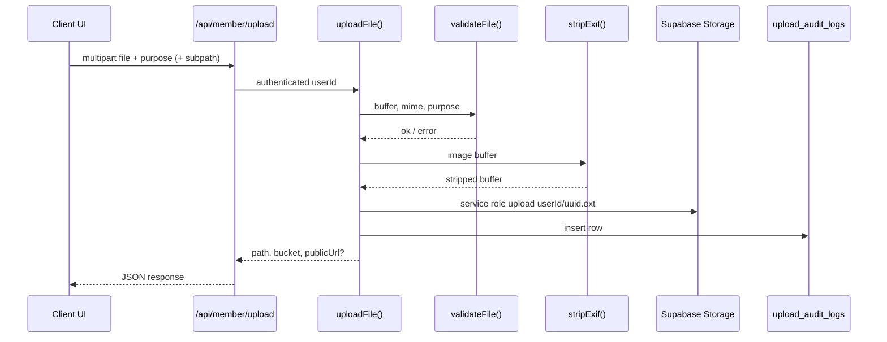

# Storage Architecture

Hardened file upload and Supabase Storage layout for Girlfrnds / Bloombay.

## Inventory (pre-hardening)

### Base64 / client data URL usage

| Location | Usage | Status |
|----------|-------|--------|
| `app/components/plans/sticker-keyboard.tsx` | `readAsDataURL` for UI preview only | OK — not persisted |
| `app/components/plans/day-editor-sheet.tsx` | `readAsDataURL` for UI preview only | OK — not persisted |
| `app/components/portal/plans/*` | Same as plans | OK — not persisted |
| `app/components/portal/lounge-page.tsx` | Preview only | OK — not persisted |
| `app/components/portal/zone-interior.tsx` | Compose image preview | TODO — wire to `/api/member/upload` before post |
| SVG `data:image` in CSS textures | Decorative grain | OK — not uploads |
| `app/api/member/profile-photos` | Was accepting any URL | **Blocked** — rejects `data:` URLs |

### Legacy Supabase buckets (migration 014 / 111)

| Bucket | Public | Notes |
|--------|--------|-------|
| `avatars` | Yes | Still used; new uploads via `uploadFile` |
| `profile-photos` | Yes | Legacy gallery; migrate to `avatars` |
| `verification` | No | Legacy selfies; new → `verification-selfies` |
| `club-media` | Yes | Legacy club audio/images |
| `member-memories` | Yes | Moments |
| `club-covers` | Yes | Club covers/photos |
| `event-media` | Yes | Legacy events |
| `hanger` | Yes | Hanger listings |
| `avenue-media` | Yes | Avenue posts |
| `girlmate-media` | Yes | **Deprecated** — was public; media now private |
| `media` | Yes | Generic moments |

## Hardened buckets (migration 117)

### Public buckets

| Bucket | Purpose | Max size | Allowed MIME types |
|--------|---------|----------|-------------------|
| `avatars` | Profile avatars, gallery photos | 5 MB | jpeg, png, webp, gif |
| `club-covers` | Club covers, crests, club photos | 10 MB | jpeg, png, webp, svg |
| `event-covers` | Event cover images, voice notes | 10 MB | jpeg, png, webp, audio/* |
| `city-assets` | Partner/city imagery, GirlMate public covers | 10 MB | jpeg, png, webp |
| `brand-assets` | Avenue, hanger, brand content | 8 MB | jpeg, png, webp, svg |

### Private buckets

| Bucket | Purpose | Max size | Allowed MIME types |
|--------|---------|----------|-------------------|
| `government-ids` | Government ID scans | 10 MB | jpeg, png, webp, pdf |
| `verification-selfies` | Membership verification selfies | 10 MB | jpeg, png, webp |
| `girlmate-private` | GirlMate voice/video, interior photos, leases | 50 MB | images, video, audio |
| `moderation-evidence` | Staff moderation attachments | 10 MB | jpeg, png, webp, pdf |
| `reports` | Member report evidence | 10 MB | jpeg, png, webp, mp4, pdf |

## Upload flow



**Path convention:** `{userId}/{optional-subpath}/{uuid}.{ext}` — never predictable names like `passport.jpg`.

**Server entry point:** `lib/storage/upload-file.ts` → `uploadFile()`.

**Client wrapper:** `lib/storage/client-api.ts` → `uploadViaApi()` (calls API; no direct storage writes for migrated flows).

## RLS policy summary

| Bucket type | INSERT | SELECT |
|-------------|--------|--------|
| Public | Authenticated; path prefix `{auth.uid()}/...` | Public read |
| Private (member) | Authenticated; own prefix only | **No public read** — service role + signed URLs |
| Private (staff) | `moderation-evidence`: admin/founder/moderator | Staff policies on gov ID / verification (service role used in API) |

Server uploads use `SUPABASE_SERVICE_ROLE_KEY` via `createAdminClient()`.

## Government ID access policy

| Who | Access | TTL |
|-----|--------|-----|
| Member | Upload own ID to `government-ids` | — |
| Admin / founder / moderator | Signed URL via `GET /api/admin/government-id?userId=` | **300s** |
| Public | **Never** | — |

Access is logged in `admin_audit_logs` (`action: private_file_access`).

Storage path stored in `profiles.gov_id_storage_path` (never a public URL).

## Verification selfie access policy

| Who | Access | TTL |
|-----|--------|-----|
| Member | Upload via `POST /api/member/verification/upload` | — |
| Admin / founder / moderator | `GET /api/admin/verification-photo?userId=` | **300s** |
| Public | **Never** | — |

Legacy paths in `verification` bucket are resolved automatically.

## Girlmates privacy rules

1. **Voice notes and video intros** → `girlmate-private` (stored as `bucket:path` in listing fields).
2. **No exact-address photos** in public buckets — interior/lease/docs only in `girlmate-private`.
3. **Public listing covers** (when added) → `city-assets` via purpose `girlmate_cover`.
4. Legacy `girlmate-media` public bucket must not receive new uploads.

## Migration status

### Routes using `uploadFile` (server)

| Route | Purpose |
|-------|---------|
| `POST /api/member/upload` | General authenticated uploads |
| `POST /api/member/verification/upload` | Verification selfie |
| `POST /api/member/upload/government-id` | Government ID |

### Client flows migrated to API (`uploadViaApi` / `upload.ts`)

| Flow | File |
|------|------|
| Avatar upload | `lib/storage/upload.ts`, `avatar-upload.tsx`, onboard step 3, passport page |
| Club cover/photo/crest | `lib/storage/upload.ts` |
| Event photo/voice | `lib/storage/upload.ts` |
| Profile gallery | `lib/storage/upload.ts` |
| Partner photos | `lib/storage/upload.ts` |
| Hanger images | `lib/storage/upload.ts` |
| Verification selfie | `onboard-flow.tsx` → `/api/member/verification/upload` |
| GirlMate voice/video | `girlmate-page.tsx` → private bucket |

### Legacy / TODO (direct client storage — migrate next)

| Location | Bucket | Notes |
|----------|--------|-------|
| `app/components/avenue/fashion-post-sheet.tsx` | `avenue-media` | TODO → `brand-assets` via API |
| `app/components/avenue/magazine-page.tsx` | `avenue-media` | TODO |
| `app/components/portal/magazine-page.tsx` | `avenue-media` | TODO |
| `app/components/avenue/hanger-inquiry-sheet.tsx` | `avenue-media` | TODO |
| `app/components/portal/hanger-inquiry-sheet.tsx` | `avenue-media` | TODO |
| `app/components/portal/club-media-section.tsx` | `club-media` | TODO → `club-covers` / API |
| `app/components/portal/create-moment-sheet.tsx` | `media` | TODO |
| `lib/media/upload-client.ts` | various | TODO — replace with `client-api` |
| Report evidence from UI | — | Use `purpose: report_evidence` on `/api/member/upload` |
| GirlMate private media playback | — | TODO signed URL endpoint for listing owner/matches |

## Environment variables

| Variable | Required | Use |
|----------|----------|-----|
| `NEXT_PUBLIC_SUPABASE_URL` | Yes | Public object URLs |
| `SUPABASE_SERVICE_ROLE_KEY` | Yes | Server uploads, signed URLs, audit inserts |
| `NEXT_PUBLIC_SUPABASE_ANON_KEY` | Yes | Client auth (uploads go through API) |

## Dependencies

- **`sharp`** — server-side EXIF strip + image dimension validation (`lib/storage/strip-exif.ts`, `validate-file.ts`).

## Audit tables

### `upload_audit_logs`

| Column | Description |
|--------|-------------|
| `user_id` | Uploader |
| `file_type` | MIME type |
| `bucket` | Storage bucket |
| `path` | Object path |
| `purpose` | e.g. `avatar`, `government_id`, `verification_selfie` |
| `file_size_bytes` | Size after processing |
| `metadata` | Optional JSON |
| `created_at` | Timestamp |

Inserts via service role from `uploadFile()`. Readable by admin/founder/moderator.

### `admin_audit_logs`

Private file access by staff (`getPrivateFileUrl`) writes here via `lib/admin/audit-log.ts`.

## Code map

```
lib/storage/
  buckets.ts          — bucket constants, purpose → bucket
  validate-file.ts    — MIME, size, dimensions, magic bytes
  strip-exif.ts       — sharp EXIF removal
  upload-file.ts      — single server upload entry point
  signed-url.ts       — staff signed URLs (300s)
  client-api.ts       — browser → API bridge
  upload.ts           — client helpers (avatar, club, event…)
  validate.ts         — client pre-check (legacy, onboard selfie)
  index.ts            — barrel export
```

Migration: `supabase/migrations/117_storage_hardening.sql`
